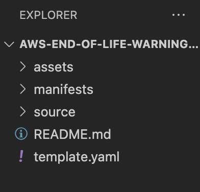

# Creating an AWS End-of-Life Warning Dashboard

This project shows how to deploy an End-of-Life (EOL) warning dashboard that users can use to stay informed and up-to-date about EOL concerns within their account. This dashboard collects configuration information from [Amazon Relational Database Service](https://aws.amazon.com/rds/) (RDS) Instances, [Amazon Elastic Compute Cloud](https://aws.amazon.com/ec2/) Amazon Machine Images (EC2 AMIs), and [AWS Lambda Runtimes](https://aws.amazon.com/lambda/). 

## Supporting Blog Posts
[End-of-Life Warning Dashboard](https://quip-amazon.com/JzDSAn5nla0Y/End-of-Life-Warning-Dashboard)

## Architecture


1. A user requests a manual refresh of the data CSV files in S3 by sending a GET request to the API.
2. The API triggers a Lambda proxy function that creates and sends a refresh event to EventBridge using the [put_events](https://boto3.amazonaws.com/v1/documentation/api/latest/reference/services/events.html#EventBridge.Client.put_events) command. 
    - Alternatively, a scheduled refresh is activated within EventBridge on a daily basis.

3. A custom EventBus triggers the EventBridge rule to invoke the data capture Lambda functions.
4. Lambda functions gathering data for Lambda runtime and RDS instance access necessary data from AWS Config while the EC2 instance Lambda function retrieves data with the [describe_instance](https://boto3.amazonaws.com/v1/documentation/api/latest/reference/services/ec2.html#EC2.Client.describe_instances) command. Each function overwrites its respective CSV with the updated data. Additional calculations are performed such as determining the gap in major versions between in-use and most recent versions for engines and runtimes within RDS and Lambda.
5. CSV files are uploaded to an S3 bucket (designated by the user upon installation) using [put_object](https://boto3.amazonaws.com/v1/documentation/api/latest/reference/services/s3.html#S3.Client.put_object).
6. QuickSight utilizes JSON manifest files hosted in the S3 bucket to designate the CSV files as data sources and builds a [SPICE](https://docs.aws.amazon.com/quicksight/latest/user/spice.html) data set for each source. [Data sets refresh](https://docs.aws.amazon.com/quicksight/latest/user/refreshing-imported-data.html) manually or on schedules determined and activated by the user.
7. QuickSight loads and visualizes the data for the user and optionally sends [threshold alerts](https://docs.aws.amazon.com/quicksight/latest/user/threshold-alerts.html) in the form of email notifications if at-risk RDS or Lambda instances are detected.

### AWS Services used in the solution
- [Amazon QuickSight](https://aws.amazon.com/quicksight/) 
- [AWS Lambda](https://aws.amazon.com/lambda/)
- [Amazon EventBridge](https://aws.amazon.com/eventbridge/)
- [AWS Config](https://aws.amazon.com/config/)
- [Amazon API Gateway](https://aws.amazon.com/api-gateway/)
- [Amazon Simple Storage Service](https://aws.amazon.com/s3/) 

## Prerequisites
* [An AWS account](https://signin.aws.amazon.com/signin?redirect_uri=https%3A%2F%2Fportal.aws.amazon.com%2Fbilling%2Fsignup%2Fresume&client_id=signup)
* [AWS SAM CLI](https://docs.aws.amazon.com/serverless-application-model/latest/developerguide/serverless-sam-cli-install.html)
* [An AWS Identity and Access Management](http://aws.amazon.com/iam)(IAM) role with appropriate access
* [AWS QuickSight Enterprise Edition](https://aws.amazon.com/quicksight/pricing/)

## Project Structure
```
aws-end-of-life-warning-dashboard/
├── assets - This has the image files used for the README.md
├── manifests - This holds the manifest JSON files that are needed for QuickSight. These are the ones you need to change before putting into S3  
├── source
    ├── dashboard-ec2-function.zip
    ├── dashboard-init-function.zip
    ├── dashboard-lambda-function.zip
    ├── dashboard-proxy-function.zip
    ├── dashboard-rds-function.zip
└── template.yaml - A template that defines the application's AWS resources
```

## Solution Deployment Walkthrough
At a high-level, hre are the steps to get the solution running:
1. Deploy the solution using any IDE (This guide uses Visual Studio Code (VS Code).
2. Deploy the soltion with the SAM CLI if step 1 is not used.
3. Test the solution.

Detailed steps are provided below

### 1. Download the solution using Visual Studio Code and AWS Toolkit
Download the code from the Github [repository](https://github.com/Tyarporn/aws-end-of-life-warning-dashboard).
```
git clone https://github.com/Tyarporn/aws-end-of-life-warning-dashboard
```
You can follow the steps [here]([https://www.jetbrains.com/help/pycharm/manage-projects-hosted-on-github.html](https://docs.microsoft.com/en-us/azure/developer/javascript/how-to/with-visual-studio-code/clone-github-repository?tabs=create-repo-command-palette%2Cinitialize-repo-activity-bar%2Ccreate-branch-command-palette%2Ccommit-changes-command-palette%2Cpush-command-palette)) to clone the project from Github
You should be able to see the project as shown here, please take a moment to review the project files:
    

    
If you have not already, please set up your AWS crendentials for the [AWS Toolkit](https://aws.amazon.com/visualstudiocode/). Also, ensure that the [AWS SAM CLI](https://aws.amazon.com/serverless/sam/) is installed.
    
### 2. Build the solution using AWS SAM CLI
Refer to the [Supporting Blog](https://quip-amazon.com/JzDSAn5nla0Y/End-of-Life-Warning-Dashboard) post for instructions on how to use AWS SAM CLI
### 3. Use the solution
Refer to the [Supporting Blog](https://quip-amazon.com/JzDSAn5nla0Y/End-of-Life-Warning-Dashboard) post for instructions on how to use the dashboard
    
## Cleanup
To delete the application stack using the AWS CLI you can run the following command (replace stack-name with your actual stack name).
```
aws cloudformation delete-stack --stack-name <stack-name>
```
You can also delete the CloudFormation stack in VS Code by right clicking the project in the AWS Explorer pane as shown below:

    
    
    
